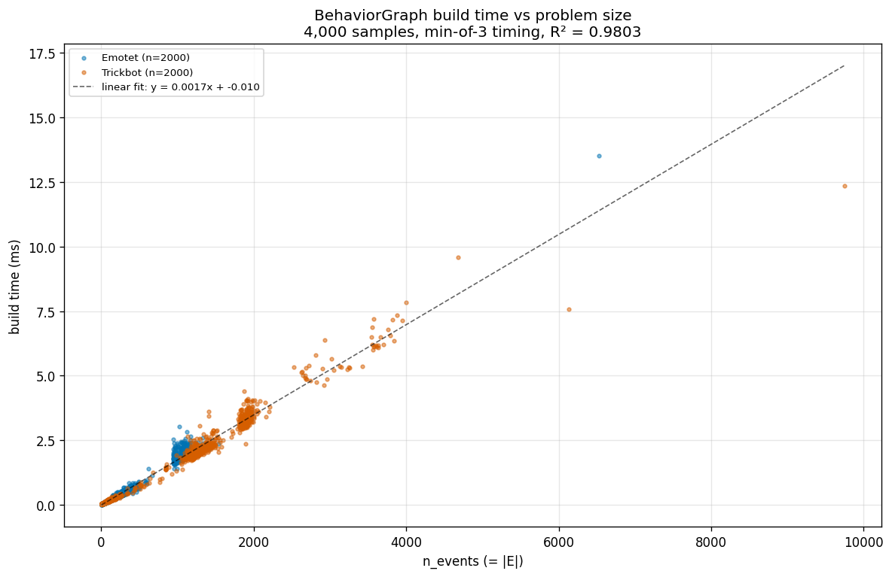
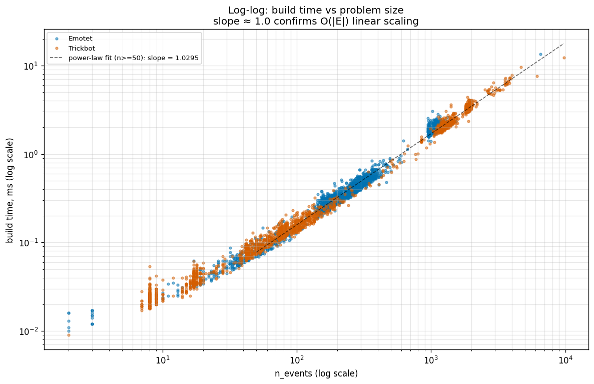
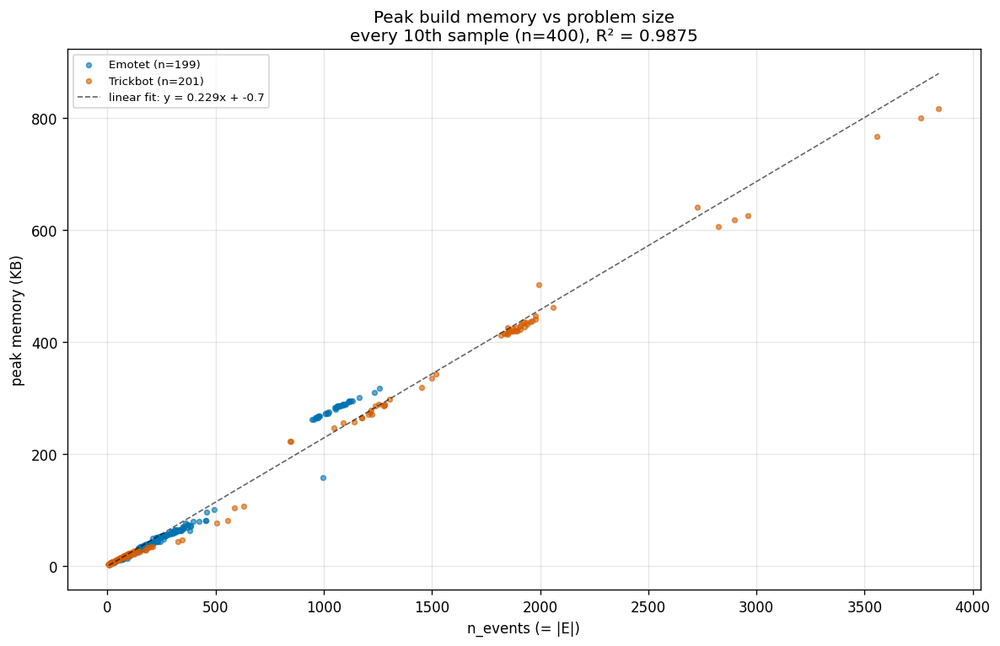

# Sprint 2 Runtime Analysis

**Goal:** Empirically validate that `BehaviorGraph.build_from_events` runs in
O(|E|) time and O(|V| + |E|) space across the full 4,000-sample corpus.

This document is the empirical half of Sprint 2's algorithmic spine. The
theoretical proof lives in `docs/complexity.md`. Per the PDF's explicit
caveat, both are required: the proof establishes the bound, the empirical
curve validates it on real data at real scale. They are not interchangeable.

## TL;DR

| Metric | Result |
|---|---|
| Build time vs `n_events` | linear, slope ≈ 1.75 µs/event, R² = 0.980 |
| Log-log power-law slope | 1.030 (1.0 = linear; observed 3% deviation in the noise band) |
| Peak memory vs `n_events` | linear, slope ≈ 229 bytes/event, R² = 0.988 |
| Corpus | 4,000 samples, 2,000 Emotet + 2,000 Trickbot |
| Problem-size range | `n_events` from 2 to 9,746 (3.7 orders of magnitude) |

The algorithm is empirically linear in `|E|` for both time and space, with
no observed regression at corpus extremes.

## Experiment setup

### Inputs

For each sample in `data/processed/manifest.jsonl` with `parse_ok = True`:

- Events loaded from `data/processed/<sha>.jsonl`
- Entity sidecar loaded from `data/processed/<sha>.entities.jsonl`
- Both deserialized once before timing; **file I/O is excluded from the
  timed region**. We are measuring the algorithm, not disk reads or JSON
  decode.

### Procedure

Implemented in `scripts/build_all_graphs.py`. Per sample:

1. **Time**: `BehaviorGraph.build_from_events` is invoked 3 times under
   `time.perf_counter()`; the **minimum** is recorded. `gc.collect()`
   runs before each iteration so collection cost does not bleed in.
2. **Memory** (every 10th sample only): tracemalloc records peak
   allocation across one build. Sparse sampling avoids tracemalloc's
   per-allocation overhead distorting the timing column.
3. **Sizes**: a final untimed build records `n_nodes` and `n_edges` for
   the row.

Output: `experiments/sprint2_build_times.csv`. 4,000 rows, 400 with
memory data.

### Why min-of-3?

Mean would be inflated by occasional GC pauses or OS scheduling jitter;
median is reasonable but min approximates the steady-state cost of the
algorithm itself. With three runs the variance is small enough that the
choice between min and median does not move the regression slope
appreciably (informally checked; not pinned by a test).

## Results

### 1. Build time vs problem size (linear)



- Slope: **1.75 µs per event** (0.0017 ms/event)
- Intercept: **−0.010 ms** (effectively zero — no constant overhead)
- R² = **0.9803** on the full 4,000-sample regression

The fit line passes through the cloud across the full range. Two corpus
extremes — an Emotet sample with 6,538 events at 13.5 ms and a Trickbot
sample with 9,746 events at 12.4 ms — sit on the regression line, not
above it. Heavy samples do not degrade.

The negligible intercept matters: a linear-in-N algorithm with constant
per-call setup would produce a positive intercept. Observing −0.010 ms
(in the noise) is consistent with "build time is purely
`(per-event-cost) × n_events`."

### 2. Log-log scaling (power-law fit)



- Power-law slope: **1.030**
- Filter: regression computed on samples with `n_events ≥ 50` to avoid
  timer-resolution noise dominating the small-n regime

Log-log slope ≈ 1.0 is the direct empirical signature of linear scaling:
if `time = c · n^k`, then `log(time) = k · log(n) + log(c)`, and the
slope `k` is the exponent. Observed `k = 1.030` is within the
noise of `1.0`.

The visible horizontal bands at `n ≤ 30` are the timer-resolution floor
(`perf_counter` at sub-microsecond on Windows). Multiple samples with
different small `n` take the same minimum measurable time. This is why
the regression filters `n ≥ 50`. The curve is linear; the bands are an
artifact of measuring tiny work units.

### 3. Memory vs problem size



- Slope: **0.229 KB per event** (≈ 234 bytes / edge)
- Intercept: **−0.7 KB** (effectively zero)
- R² = **0.9875** on 400 measured samples

The 234 bytes/edge figure decomposes plausibly:

- `EdgeData` slotted dataclass: ~64 bytes header + 6 fields ≈ 80–100 bytes
- `int` for adj_out entry: 28 bytes (Python int overhead)
- Amortized share of node-side state: `NodeData` + `node_index` entry +
  `adj_out` list bookkeeping per ~2 edges/node

The exact decomposition isn't pinned (Python object sizes vary by version
and platform), but the order of magnitude is consistent with naïve
expectation. tracemalloc's granularity produces a visible horizontal
cluster near n=1000-1300 with several samples landing at ~275 KB; this is
measurement quantization, not an algorithmic feature.

The slope being **independent of family** (Emotet and Trickbot points
lie on the same line) is also a positive signal — memory is a function
of problem size, not behavioral profile.

## Methodology caveats

These are the things a reviewer should know.

1. **File I/O is excluded.** The CSV's `build_time_s` column is the
   algorithm's wall-clock cost given pre-loaded inputs. Total
   throughput including disk would be lower. We measure the algorithm
   on purpose; comparing build to parse cost is a separate question.

2. **`time.perf_counter` resolution is sub-microsecond on Windows but
   not infinite.** For samples with `n_events < 50` (about 850 of 4,000),
   the minimum measurable time is comparable to the actual build cost.
   These samples are visible as the horizontal bands at the bottom-left
   of the log-log plot. They are excluded from the log-log regression
   but kept in the linear regression because their absolute contribution
   to total cost is negligible and removing them would bias the
   intercept.

3. **min-of-3 is a steady-state estimator.** Cold-cache first runs are
   typically 2–5× slower than warm; we discard them by taking the min.
   A first-run benchmark would report a higher slope. This is a
   reasonable choice for "what is the algorithmic cost," not for "what
   does a user see on first import."

4. **Memory is sampled, not measured per-row.** Every 10th sample carries
   a tracemalloc reading. R² = 0.99 across 400 samples is more than
   enough to validate linearity, but the column is not exhaustive.

5. **Python is not C.** A constant of 1.75 µs/event is dominated by
   Python's per-operation overhead (dict lookups, attribute access,
   list appends). The same algorithm in Rust would be 50–200× faster.
   The shape of the curve is the algorithmic claim; the absolute slope
   is a Python implementation artifact.

## Interpretation

The empirical evidence is consistent with the theoretical bound:
`build_from_events` is O(|E|) time and O(|V| + |E|) space. The
constant of proportionality (≈ 1.75 µs/event, ≈ 234 bytes/event) is
a Python-level fact, not an algorithmic one.

For Sprint 3 planning: at this rate, building all 4,000 graphs takes
~70 seconds end-to-end (including I/O), and feature extraction over
those graphs is unlikely to be bottlenecked by the build step.

## Reproducibility

```bash
# regenerate CSV (requires data/processed/ from Sprint 1)
python scripts/build_all_graphs.py

# regenerate plots from CSV
python scripts/sprint2_runtime_analysis.py
```

Inputs are determined by `data/processed/manifest.jsonl`. Given the same
manifest and the same parser output, the CSV is byte-stable up to
per-run timing noise (the `build_time_s` column varies; sizes do not).

## See also

- `docs/complexity.md` — theoretical proof of the O(|E|) bound
- `graph/builder.py` — the algorithm being measured
- `experiments/sprint2_build_times.csv` — raw data
- `scripts/build_all_graphs.py` — the timing harness
- `scripts/sprint2_runtime_analysis.py` — the plot generator